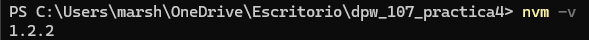
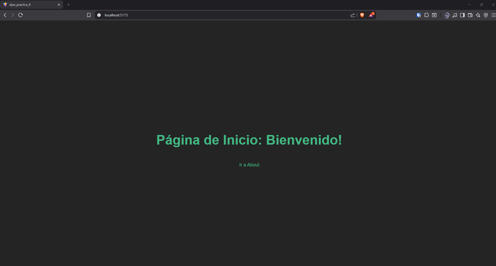
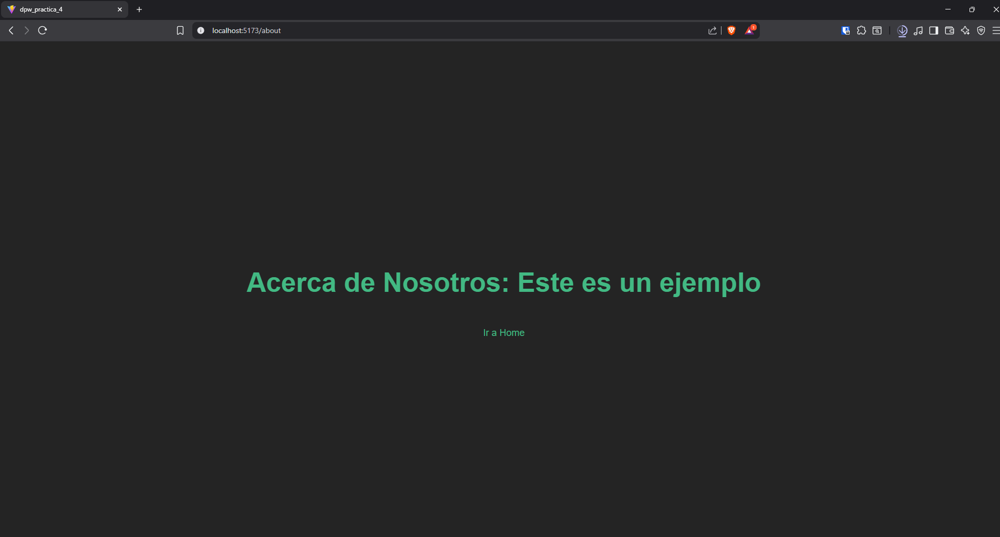
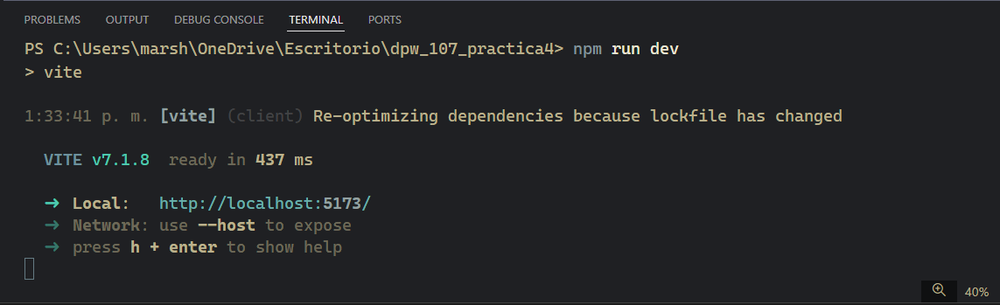

# Práctica 4 - Introducción a VueJS con Vue Router

## Información del Proyecto

- **Asignatura:** Diseño y Programación Web I
- **Práctica:** Práctica 4 - Frameworks de Frontend
- **Framework:** VueJS 3
- **Enrutamiento:** Vue Router 4

## Descripción

Esta práctica tiene como objetivo introducir al estudiante en el uso de frameworks modernos de desarrollo frontend. Se desarrolló una aplicación web básica utilizando VueJS, inicializada con Vite, implementando navegación entre dos rutas (Home y About) mediante Vue Router.

## Requisitos Previos

- Node.js (versión 18 o superior)
- npm (Node Package Manager)

## Instalación

### 1. Clonar el repositorio

```bash
git clone https://github.com/marshelaillon/dpw_107_practica4
cd dpw_107_practica4
```

### 2. Instalar dependencias

```bash
npm install
```

### 3. Ejecutar en modo desarrollo

```bash
npm run dev
```

La aplicación estará disponible en `http://localhost:5173`

## Funcionalidades Implementadas

### ✅ Ruta Home (/)
- Muestra el mensaje: "Página de Inicio: Bienvenido!"
- Contiene un enlace de navegación a la página About

### ✅ Ruta About (/about)
- Muestra el mensaje: "Acerca de Nosotros: Este es un ejemplo"
- Contiene un enlace de navegación a la página Home

## Capturas de Pantalla

### NVM



---

### Página Home



---

### Página About



---

### Terminal - Ejecución del proyecto

